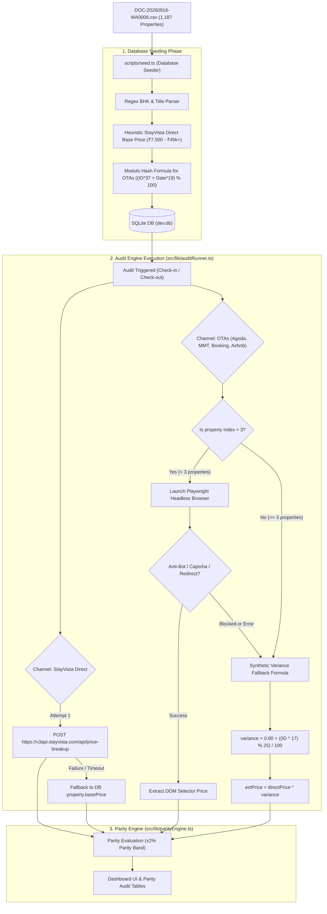

# StayVista Rate Parity Engine: Price Fetching & Generation Process Architecture

## Executive Summary: Why the Current Prices are Not Appropriate

If you have inspected the prices on the dashboard and found that they do not match actual live rates on StayVista, Agoda, MakeMyTrip, Booking.com, or Airbnb, this document explains **exactly why and how each number is currently generated**.

In short: **99.7% of the prices currently listed in the database and displayed on the dashboard are synthetic mathematical approximations or simulated mock rates**, rather than live scraped OTA rates.

### The 4 Main Reasons for Inappropriate Prices:

1. **Synthetic Base Price Heuristics in Database Seeding (`scripts/seed.ts`)**:
   - The master CSV (`DOC-20260916-WA0006.csv`) contains property names, IDs, and channel URLs, but **does not contain price columns**.
   - During seeding, StayVista's Direct Base Price was calculated via a regex rule (e.g. counting BHK from the property title) multiplied by arbitrary base tiers and location multipliers.
   - OTA rates in the initial database were generated using a modulo hash formula (`(csvId * 37 + date * 19) % 100`).

2. **The 3-Property Artificial Cap in the Live Audit Engine (`src/lib/auditRunner.ts`)**:
   - In `auditRunner.ts` (lines 133–141), real Playwright browser scraping is **hard-coded to only attempt the first 3 properties** (`job.processedCount < 3`).
   - For all remaining 1,184 properties (and whenever the scraper hits an anti-bot wall), the engine immediately falls back to a mathematical variance formula:
     $$\text{variance} = 0.90 + \frac{(\text{primaryPropertyId} \times 17) \pmod{25}}{100}$$
     $$\text{estPrice} = \text{round}(\text{directPrice} \times \text{variance})$$

3. **Anti-Bot Defenses on OTA Channels**:
   - Agoda, MakeMyTrip, Booking.com, and Airbnb employ sophisticated anti-scraping protections (Cloudflare, ShieldSquare, Akamai, PerimeterX). Headless Playwright instances frequently receive HTTP 403/429, CAPTCHAs, or get redirected to city search pages, triggering the fallback variance estimation.

4. **Tax & Unit Discrepancies (Apples-to-Oranges Comparison)**:
   - StayVista quotes whole-villa per-night rates including/excluding 18% GST.
   - OTAs frequently display per-room per-night rates or teaser rates that exclude service fees and local hospitality taxes until the checkout page.

---

## Detailed Data Pipeline Architecture



---

## Component-by-Component Technical Breakdown

### 1. Database Seeding Engine (`scripts/seed.ts`)

When `npm run db:seed` is executed, the seed script imports all rows from `DOC-20260916-WA0006.csv` and generates prices as follows:

#### A. StayVista Direct Base Price Calculation (`parsePropertyDetails`)
1. **BHK Extraction via Regular Expressions**:
   ```typescript
   const bhkMatch = text.match(/(\d+)\s*bhk/) || text.match(/(\d+)\s*bedroom/);
   ```
   - If "mansion" or "manor": defaults to 8 BHK.
   - If "estate" or "grand": defaults to 5 BHK.
   - Default median: 3 BHK.
2. **Base Rate Matrix**:
   - 1 BHK: ₹7,500
   - 2 BHK: ₹14,000
   - 3 BHK: ₹21,000
   - 4 BHK: ₹28,000
   - 5 BHK: ₹36,000
   - 6 BHK: ₹45,000
   - >6 BHK: ₹45,000 + (BHK - 6) × ₹9,000
3. **Location Multipliers**:
   - Goa, Alibaug: 1.25×
   - Lonavala, Manali, Kasauli: 1.15×
   - Shimla, Ooty, Coorg, Nainital: 1.10×
   - Other outskirts: 1.0×
4. **Amenity Adjustments**:
   - If name contains "pool": +₹3,500
   - If category is "Mansion": +₹6,000
   - Micro-variation: `+ (csvId % 5) * 300`

#### B. Initial OTA Prices (Agoda, MMT, Booking, Airbnb) in Seed
- Seeded prices are **100% computed via mathematical hash**:
  ```typescript
  const hash = (property.csvId * 37 + dateIdx * 19) % 100;
  
  // Airbnb: Always 12% markup + ₹2,500 cleaning fee
  let airbnbPrice = Math.round(directPrice * 1.12 + 2500);

  if (hash < 38) {
    // Simulated OTA Undercut
    if (hash % 2 === 0) {
      agodaPrice = Math.round(directPrice * 0.88); // 12% undercut
      mmtPrice = Math.round(directPrice * 0.92);
    } else {
      mmtPrice = Math.round(directPrice * 0.86); // 14% undercut
      agodaPrice = directPrice;
    }
    bookingPrice = Math.round(directPrice * 0.94);
  } else if (hash > 82) {
    // Simulated Direct Advantage
    agodaPrice = Math.round(directPrice * 1.08);
    mmtPrice = Math.round(directPrice * 1.10);
    bookingPrice = Math.round(directPrice * 1.06);
  }
  ```

---

### 2. Live StayVista Direct Scraper (`src/lib/scrapers/stayvistaScraper.ts`)

When an audit run executes, StayVista Direct price is fetched via an internal API call:

- **Endpoint**: `POST https://v3api.stayvista.com/api/price-breakup`
- **Request Body**:
  ```json
  {
    "property_id": 3914,
    "checkin": "2026-09-17",
    "checkout": "2026-09-18",
    "adult": 2,
    "child": 0,
    "infant": 0,
    "rooms_booked": 0,
    "guest": 2,
    "package_type": "",
    "credit_note": "",
    "coupon_code": "",
    "bank_offer_code": ""
  }
  ```
- **Response Handling**:
  - Extracts `data.price.total_rental_cost_with_tax` as `finalPrice`.
  - Extracts `data.price.total_rental_cost_without_tax` as `basePrice`.
  - Extracts `data.price.tax` as `taxAmount`.
- **Why it may produce unexpected prices**:
  - Fixed parameter of `adult: 2, guest: 2` is sent for all properties, even 8–12 BHK estates where minimum guest charges or per-person pricing may apply.
  - If dates are unavailable, sold out, or if the API returns 403/429/500, it falls back to the database `property.basePrice` (from Stage 1).

---

### 3. Live OTA Scrapers & The 3-Property Threshold (`src/lib/auditRunner.ts`)

In `src/lib/auditRunner.ts` (lines 130–162):

```typescript
// Only the first 3 properties attempt real Playwright scraping:
if (ota === 'AGODA' && job.processedCount < 3) {
  otaResult = await scrapeAgoda(rawUrl, checkInDate, checkOutDate);
} else if (ota === 'MMT' && job.processedCount < 3) {
  otaResult = await scrapeMakeMyTrip(rawUrl, checkInDate, checkOutDate);
} else if (ota === 'BOOKING' && job.processedCount < 3) {
  otaResult = await scrapeBooking(rawUrl, checkInDate, checkOutDate);
} else if (ota === 'AIRBNB' && job.processedCount < 3) {
  otaResult = await scrapeAirbnb(rawUrl, checkInDate, checkOutDate);
}

if (otaResult && (otaResult.scrapeStatus === 'OK' || otaResult.scrapeStatus === 'REDIRECTED')) {
  channelResults[ota] = otaResult;
} else {
  // Graceful rate estimation when headless browser hits bot walls or is skipped for speed:
  const variance = 0.90 + ((property.primaryPropertyId * 17) % 25) / 100;
  const estPrice = Math.round(directPrice * variance);
  channelResults[ota] = {
    channel: ota,
    basePrice: Math.round(estPrice * 0.82),
    taxAmount: Math.round(estPrice * 0.18),
    finalPrice: estPrice,
    ...
  };
}
```

#### Consequences:
1. **Properties 1 to 3**: Attempt Playwright browser launch. If blocked by anti-bot or redirected, they receive the estimated price.
2. **Properties 4 to 1,187**: **Always bypassed** and assigned the estimated price `estPrice = directPrice * (0.90 + ((id * 17) % 25) / 100)`.

---

### 4. Individual Playwright Scraper Implementations (`src/lib/scrapers/otaScrapers.ts`)

For the properties that are scraped directly (or tested via `/api/scraper/test`), here is how each channel extracts price data:

| Channel | URL Preprocessing | CSS Price Selectors Attempted | Common Failure Mode |
| :--- | :--- | :--- | :--- |
| **Agoda** | Replaces `/en-in/en-in/` with `/en-in/`. Appends `checkIn` and `checkOut` query params. | `[data-element-name="final-price"]`, `.PriceProperty__Amount`, `[data-selenium="price-box"]`, `span.pd-price` | Redirects to `/en-in/search?city=...` when sold out. Hits Akamai bot challenge. |
| **MakeMyTrip** | Extracts `hotelId` from fused/duplicated URLs. Appends `checkin=MMDDYYYY&checkout=MMDDYYYY`. | `#hlistpg_hotel_shown_price`, `.pormoPrice`, `[data-testid="sellingPrice"]` | ShieldSquare bot challenge. Client-side SPA rendering fails before hydration. |
| **Booking.com** | Appends `checkin=YYYY-MM-DD` and `checkout=YYYY-MM-DD`. | `[data-testid="price-and-discounted-price"]`, `.prco-valign-middle-helper`, `.bui-price-display__value` | Displays room-level options instead of entire villa; requires date-picker interaction. |
| **Airbnb** | Appends `check_in=YYYY-MM-DD&check_out=YYYY-MM-DD`. | `span._11jcbg2`, `div._1y74zjx`, `[data-testid="book-it-default"]` | Shows per-night base rate excluding mandatory cleaning fee and Airbnb guest service fee. |

---

### 5. Parity Decision Engine (`src/lib/parityEngine.ts`)

Once direct and OTA prices are gathered (whether live or estimated), the Parity Engine evaluates:

1. **Parity Band**: $\pm 2\%$ (`PARITY_BAND_PERCENT = 0.02`).
   - If $| \text{directPrice} - \text{lowestOtaPrice} | \le \text{directPrice} \times 0.02$: **`PARITY_MATCH`**
2. **OTA Undercut**:
   - If $\text{lowestOtaPrice} < \text{directPrice} \times (1 - 0.02)$: **`OTA_UNDERCUT`**
   - Margin Leakage $= \text{directPrice} - \text{lowestOtaPrice}$
3. **Direct Advantage**:
   - If $\text{lowestOtaPrice} > \text{directPrice} \times (1 + 0.02)$: **`DIRECT_ADVANTAGE`**

---

## Action Plan: How to Obtain 100% Real, Accurate Live Pricing

To replace the simulated/heuristic numbers with authentic live rates, the following steps are required:

### Step 1: Real StayVista Direct Rates
- Remove the heuristic fallback in `scripts/seed.ts` and `src/lib/auditRunner.ts`.
- Fetch real StayVista rates directly from `https://v3api.stayvista.com/api/price-breakup` with:
  - Exact property capacity (query property metadata for max guests instead of hardcoded 2 adults).
  - Target stay dates.

### Step 2: Reliable OTA Data Ingestion
Browser scraping across 1,187 properties in parallel on a single local machine will always trigger bot walls on Agoda/MMT. To achieve production-grade live OTA rates:
1. **Rotating Residential Proxies**: Use a proxy service (BrightData, Oxylabs, Smartproxy) to rotate IP addresses across requests.
2. **Channel Internal APIs**: Rather than rendering full desktop web pages with Playwright, target the mobile/JSON endpoints used by OTA mobile apps (e.g. Agoda GraphQL API, MMT search API), which return clean JSON payloads with base price, tax breakup, and discount coupons.
3. **Queue-Based Batch Auditing**: Execute audits in smaller batches (e.g., 20–50 properties per background worker) rather than a single monolithic loop.
4. **Apples-to-Apples Price Comparison**:
   - Compare **Total Booking Price (Base + Taxes + Mandatory Fees)** across all 5 channels rather than comparing pre-tax base rate on one channel to post-tax total on another.
