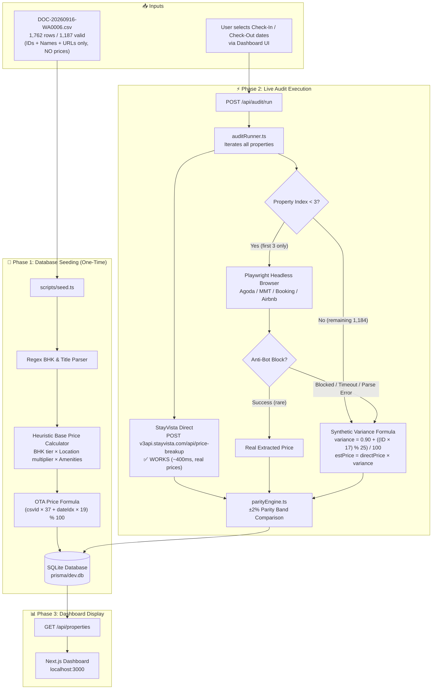
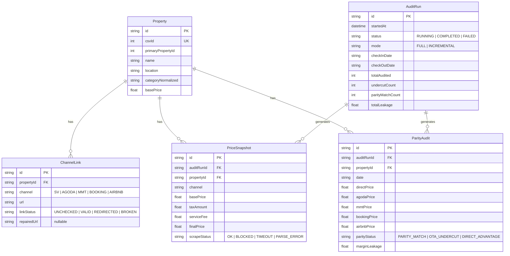
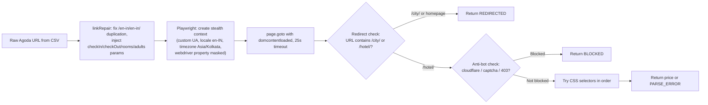
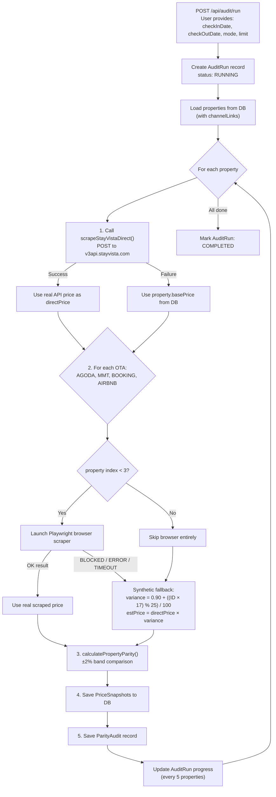

# StayVista Rate Parity Engine — System Documentation & Architecture

> **Document Purpose:** Shareable technical reference for discussing proposed changes to the scraper bot.
> **Last Updated:** 2026-09-21
> **Repository:** [github.com/omeshwarsgit/omeshwarsstayvista](https://github.com/omeshwarsgit/omeshwarsstayvista)

---

## Table of Contents

1. [Tech Stack](#1-tech-stack)
2. [Input Data Provided](#2-input-data-provided)
3. [Project File Structure](#3-project-file-structure)
4. [System Architecture & Data Flow](#4-system-architecture--data-flow)
5. [Database Schema](#5-database-schema)
6. [Scraping Architecture — Per Channel](#6-scraping-architecture--per-channel)
7. [Audit Engine Execution Flow](#7-audit-engine-execution-flow)
8. [Parity Engine Logic](#8-parity-engine-logic)
9. [Dashboard & API Layer](#9-dashboard--api-layer)
10. [Known Issues & Current Limitations](#10-known-issues--current-limitations)
11. [Discussion Topics for Proposed Changes](#11-discussion-topics-for-proposed-changes)

---

## 1. Tech Stack

| Layer | Technology | Version | Purpose |
|:------|:-----------|:--------|:--------|
| **Framework** | Next.js (App Router) | 15.5.25 | Full-stack React framework (API routes + SSR dashboard) |
| **Language** | TypeScript | 5.7.3 | Type-safe development across all files |
| **Database** | SQLite via Prisma ORM | Prisma 6.4.0 | Local embedded database (`prisma/dev.db`) |
| **Browser Automation** | Playwright (Chromium) | 1.63.0 | Headless browser scraping for Agoda, MMT, Booking, Airbnb |
| **HTTP Client** | Native `fetch` (Node.js) | Built-in | Direct API calls for StayVista pricing endpoint |
| **CSV Parser** | csv-parse | 5.6.0 | Parsing input property CSV dataset |
| **UI Components** | React 19 + Lucide Icons + Recharts | — | Dashboard visualization and charting |
| **CSS** | Tailwind CSS 4.0 | 4.0.7 | Utility-first styling |
| **Runtime** | tsx | 4.19.2 | TypeScript execution for seed and utility scripts |

---

## 2. Input Data Provided

### Primary Input: CSV File

**File:** `DOC-20260916-WA0006.csv`
**Size:** 1,085,520 bytes (~1.0 MB)
**Total Rows:** 1,762 (including header)
**Valid Rows (after filtering):** 1,187 properties

#### CSV Column Schema

| Column | Description | Example |
|:-------|:------------|:--------|
| `ID` | Unique row identifier (integer) | `5` |
| `Primary_Property_ID` | StayVista internal property ID (used in API calls) | `5` |
| `Property_Name` | Human-readable property name | `The Boulevard Villa` |
| `SV` | StayVista direct URL (slug-based) | `https://www.stayvista.com/villa/the-boulevard-villa-4-bhk-villa-in-lonavala-with-private-pool-and-spacious-rooms` |
| `Agoda` | Agoda listing URL | `https://www.agoda.com/en-in/the-boulevard-by-vista-rooms/hotel/lonavala-in.html` |
| `MMT` | MakeMyTrip listing URL (often malformed/fused) | `https://www.makemytrip.com/hotels/hotel-details/?hotelId=201812311719539456&...` |
| `Booking` | Booking.com listing URL | `https://www.booking.com/hotel/in/the-boulevard-lonavla.html` |
| `Airbnb` | Airbnb listing URL | `https://www.airbnb.com/rooms/1313520797064200631` |

> [!IMPORTANT]
> **The CSV contains NO price columns.** It only provides property identifiers and channel URLs. All prices currently in the system are either fetched live from the StayVista API or synthetically generated via mathematical formulas.

#### CSV Data Quality Issues Detected

- **~91.6% of MMT URLs are malformed:** Two URLs fused together, e.g., `...mtkeys=defaultMtkey1000225027https://www.makemytrip.com/hotels/hotel-details/?hotelId=`
- **Some Agoda URLs have doubled locale paths:** `/en-in/en-in/` instead of `/en-in/`
- **575 rows filtered out** due to missing fields or `#REF!` values
- The link repair module (`src/lib/linkRepair.ts`) auto-corrects these issues at runtime

---

## 3. Project File Structure

```
StayVistaScrapper/
├── prisma/
│   ├── schema.prisma          # Database schema (5 models)
│   ├── seed.ts                # Database seeder (generates synthetic prices)
│   └── dev.db                 # SQLite database file (~24 MB)
├── scripts/
│   ├── seed.ts                # Alternate seed script
│   └── validateLinks.ts       # Standalone link validation utility
├── src/
│   ├── app/
│   │   ├── page.tsx           # Main dashboard UI (React client component)
│   │   ├── layout.tsx         # Root layout
│   │   ├── globals.css        # Global styles
│   │   └── api/
│   │       ├── audit/
│   │       │   ├── run/route.ts       # POST: Start audit run
│   │       │   ├── status/[runId]/route.ts  # GET: Poll audit progress
│   │       │   └── cancel/[runId]/route.ts  # POST: Cancel running audit
│   │       ├── properties/
│   │       │   ├── route.ts           # GET: List properties with parity data
│   │       │   └── sync/route.ts      # POST: Sync properties from CSV
│   │       ├── property/[id]/route.ts # GET: Single property detail
│   │       ├── calendar/route.ts      # GET: Calendar view data
│   │       ├── export/route.ts        # GET: CSV export
│   │       ├── links/validate/route.ts # POST: Validate channel links
│   │       └── scraper/test/route.ts  # POST: Test individual scraper
│   ├── components/
│   │   ├── DashboardHeader.tsx
│   │   ├── StatCards.tsx
│   │   ├── ParityTable.tsx
│   │   ├── ParityCalendarView.tsx
│   │   ├── CategoryBreakdown.tsx
│   │   ├── PropertyDetailDrawer.tsx
│   │   ├── AuditDateModal.tsx
│   │   └── ScraperStatusPanel.tsx
│   └── lib/
│       ├── prisma.ts                  # Prisma client singleton
│       ├── parityEngine.ts            # Parity calculation logic (±2% band)
│       ├── auditRunner.ts             # Audit orchestrator (iterates properties)
│       ├── linkRepair.ts              # URL repair for malformed CSV links
│       ├── linkValidator.ts           # HTTP link health checker
│       └── scrapers/
│           ├── types.ts               # ChannelScrapeResult interface
│           ├── playwrightManager.ts   # Shared browser instance & rate limiter
│           ├── stayvistaScraper.ts     # StayVista Direct API scraper
│           └── otaScrapers.ts         # Agoda, MMT, Booking, Airbnb scrapers
├── DOC-20260916-WA0006.csv            # Master property dataset (input)
├── package.json
├── tsconfig.json
└── next.config.mjs
```

---

## 4. System Architecture & Data Flow



---

## 5. Database Schema

### 5 Models in Prisma Schema



**Current DB Stats:** 1,187 properties, 47,480 price snapshots, 8 audit runs

---

## 6. Scraping Architecture — Per Channel

### Channel 1: StayVista Direct ✅ WORKING

| Attribute | Detail |
|:----------|:-------|
| **File** | `src/lib/scrapers/stayvistaScraper.ts` |
| **Method** | HTTP POST (native `fetch`, no browser) |
| **Endpoint** | `https://v3api.stayvista.com/api/price-breakup` |
| **Latency** | ~400ms |
| **Anti-Bot** | None (internal API) |
| **Status** | ✅ Returns real live prices |

**Request Payload:**
```json
{
  "property_id": 5,
  "checkin": "2026-10-15",
  "checkout": "2026-10-16",
  "adult": 2,
  "child": 0,
  "infant": 0,
  "rooms_booked": 0,
  "guest": 2,
  "package_type": "",
  "credit_note": "",
  "coupon_code": "",
  "bank_offer_code": ""
}
```

**Response Fields Extracted:**
- `data.price.total_rental_cost_with_tax` → `finalPrice`
- `data.price.total_rental_cost_without_tax` → `basePrice`
- `data.price.tax` → `taxAmount`
- `data.price.service_charge` → `serviceFee`

**Verified Test Result (Property ID 5, Oct 15–16 2026):**
```json
{
  "channel": "SV",
  "basePrice": 5828,
  "taxAmount": 291,
  "serviceFee": 254,
  "finalPrice": 6119,
  "scrapeStatus": "OK",
  "availability": true
}
```

---

### Channel 2: Agoda ❌ NOT WORKING

| Attribute | Detail |
|:----------|:-------|
| **File** | `src/lib/scrapers/otaScrapers.ts` (lines 37–169) |
| **Method** | Playwright headless Chromium browser |
| **Anti-Bot** | Cloudflare, PerimeterX |
| **Status** | ❌ Pages load but price selectors return empty |

**Scraping Flow:**


**CSS Price Selectors Used (currently stale):**
```
[data-element-name="final-price"]
.PriceProperty__Amount
[data-selenium="price-box"]
span[class*="price-box"]
span[class*="final-price"]
.PropertyCard__Price
span.pd-price
```

**Current Test Result:** `PARSE_ERROR` — Page loads, navigates correctly, but no price selector matches current Agoda DOM.

---

### Channel 3: MakeMyTrip ❌ NOT WORKING

| Attribute | Detail |
|:----------|:-------|
| **File** | `src/lib/scrapers/otaScrapers.ts` (lines 174–302) |
| **Method** | Playwright headless Chromium browser |
| **Anti-Bot** | Akamai WAF (HTTP/2 protocol-level blocking) |
| **Status** | ❌ Connection refused at protocol level |

**URL Repair Logic (`linkRepair.ts`):**
- Extracts `hotelId` from fused URLs via regex: `/hotelId=(\d+)/i`
- Rebuilds clean URL: `https://www.makemytrip.com/hotels/hotel-details/?hotelId={id}&_uCurrency=INR&checkin={MMDDYYYY}&checkout={MMDDYYYY}&roomStayQualifier=2e0e`
- MMT date format: `MMDDYYYY` (e.g., `10152026` for Oct 15, 2026)

**CSS Price Selectors Used:**
```
[id*="revamped_price"]
#revamped_price
p[class*="priceText"]
span[class*="font28"]
.latoBlack
p.blackText
[data-testid="room-rate"]
```

**Current Test Result:** `net::ERR_HTTP2_PROTOCOL_ERROR` — Akamai WAF blocks the connection before any page content loads. Even `curl` and real Chrome via Playwright fail. The MMT WAF detects headless automation at the TLS/HTTP2 fingerprint level.

---

### Channel 4: Booking.com ❌ NOT WORKING

| Attribute | Detail |
|:----------|:-------|
| **File** | `src/lib/scrapers/otaScrapers.ts` (lines 307–424) |
| **Method** | Playwright headless Chromium browser |
| **Anti-Bot** | Cloudflare, session-based protection |
| **Status** | ❌ Page loads but price selectors return empty |

**URL Repair Logic:**
- Injects query params: `checkin`, `checkout`, `group_adults=2`, `no_rooms=1`, `group_children=0`

**CSS Price Selectors Used:**
```
[data-testid="price-and-discounted-price"]
.prco-valign-middle-helper
span[class*="prco_defaultstyle"]
.bui-price-display__value
span[class*="price-display"]
```

**Current Test Result:** `PARSE_ERROR` — Page navigates to correct hotel listing, but price is rendered dynamically by JS after initial DOM load and the selectors don't match current Booking.com structure.

---

### Channel 5: Airbnb ❌ NOT WORKING

| Attribute | Detail |
|:----------|:-------|
| **File** | `src/lib/scrapers/otaScrapers.ts` (lines 429–546) |
| **Method** | Playwright headless Chromium browser |
| **Anti-Bot** | PerimeterX, client-side JS rendering |
| **Status** | ❌ Page loads but price selectors return empty |

**URL Repair Logic:**
- Injects query params: `check_in`, `check_out`, `adults=2`

**CSS Price Selectors Used (obfuscated class names):**
```
span[class*="_1y74zjx"]
span[class*="_tyxjp1"]
[data-testid="price-item-total"]
span._11jcbg2
div._1jo4hgw
```

**Current Test Result:** `PARSE_ERROR` — Room listing loads with correct dates, Airbnb renders prices via React hydration after DOM ready, and the obfuscated CSS class names have rotated since selectors were written.

---

## 7. Audit Engine Execution Flow

**File:** `src/lib/auditRunner.ts`



> [!CAUTION]
> **Critical Issue:** The `job.processedCount < 3` guard on line 133 means **only the first 3 properties** even attempt real OTA scraping. The remaining 1,184 properties get synthetic prices that are **marked as `scrapeStatus: 'OK'`**, making them indistinguishable from real data on the dashboard.

---

## 8. Parity Engine Logic

**File:** `src/lib/parityEngine.ts`

### How Parity Status is Determined

The engine uses a **±2% percentage band** around the direct price:

```
lowerBound = directPrice × 0.98
upperBound = directPrice × 1.02
```

| Condition | Status Assigned |
|:----------|:----------------|
| Lowest OTA price < lowerBound | `OTA_UNDERCUT` |
| Lowest OTA price > upperBound | `DIRECT_ADVANTAGE` |
| Lowest OTA price within ±2% | `PARITY_MATCH` |

If fewer than 4 OTA channels returned valid data, the status is prefixed as `PARTIAL_` (e.g., `PARTIAL_OTA_UNDERCUT`).

### Leakage Calculation

```
marginLeakage = directPrice - lowestOtaPrice  (only when OTA_UNDERCUT)
```

### Status Change Tracking

The engine looks up the prior `ParityAudit` record for each property and sets `statusChanged: true` if the parity status flipped (e.g., from `PARITY_MATCH` to `OTA_UNDERCUT`).

---

## 9. Dashboard & API Layer

### API Endpoints

| Endpoint | Method | Purpose |
|:---------|:-------|:--------|
| `/api/properties` | GET | List properties with parity data for a given date |
| `/api/property/[id]` | GET | Single property detail with channel snapshots |
| `/api/audit/run` | POST | Start a new audit run |
| `/api/audit/status/[runId]` | GET | Poll audit progress |
| `/api/audit/cancel/[runId]` | POST | Cancel a running audit |
| `/api/calendar` | GET | Multi-date parity summary for calendar view |
| `/api/export` | GET | Download CSV export of parity results |
| `/api/links/validate` | POST | Validate channel link health |
| `/api/scraper/test` | POST | Test individual scraper against a property |
| `/api/properties/sync` | POST | Sync properties from CSV |

### Dashboard Behavior

- **Default date hardcoded** to `2026-09-16` in `page.tsx` line 16
- **Loads data immediately** on mount without requiring user date selection
- **Date can be changed** via the date picker or "Configure Dates" button
- **Audit modal** allows selecting check-in/check-out dates before running a new audit
- **Seeded data** exists for 7 dates (Sep 16–22, 2026), all with synthetic prices

---

## 10. Known Issues & Current Limitations

### 🔴 Critical Issues

| # | Issue | Impact | Root Cause |
|:--|:------|:-------|:-----------|
| 1 | **100% of OTA prices are fake** | Dashboard shows completely synthetic rate parity data | OTA scrapers fail due to anti-bot + 3-property cap + synthetic fallback |
| 2 | **3-property scraping cap** | Only 3 out of 1,187 properties attempt real OTA scraping | Hardcoded `job.processedCount < 3` in `auditRunner.ts:133` |
| 3 | **Synthetic prices marked as "OK"** | Cannot distinguish real vs fake data on dashboard | Fallback sets `scrapeStatus: 'OK'` instead of a distinct status |
| 4 | **MakeMyTrip completely blocked** | 0% success rate on MMT | Akamai WAF blocks at HTTP/2 protocol level (TLS fingerprinting) |
| 5 | **Stale CSS selectors** | Agoda, Booking, Airbnb selectors don't match current DOM | OTA sites have updated their frontend since selectors were written |
| 6 | **No date prompt on load** | Dashboard shows stale data from hardcoded date | `useState('2026-09-16')` on page.tsx line 16 |

### 🟡 Moderate Issues

| # | Issue | Impact |
|:--|:------|:-------|
| 7 | Base prices derived from BHK regex, not real rates | StayVista direct "seed" prices are heuristic approximations |
| 8 | Tax split is estimated (82/18 flat ratio) | OTA scrapers assume flat 18% GST split, not actual tax breakdowns |
| 9 | No retry logic for transient scrape failures | A single timeout = permanent failure for that property in that run |
| 10 | No proxy rotation or residential IP support | All requests come from same IP, increasing block probability |
| 11 | `waitUntil: 'domcontentloaded'` may be too early | Prices rendered via JS hydration may not be in DOM yet |

---

## 11. Discussion Topics for Proposed Changes

### A. Scraping Strategy Overhaul

- [ ] **Replace Playwright with API-based scraping where possible** — e.g., Agoda and Booking.com may have undocumented internal APIs (like StayVista's `price-breakup` endpoint) that return JSON without browser overhead
- [ ] **Use `networkidle` or explicit `waitForSelector`** instead of `domcontentloaded` to wait for JS-rendered prices
- [ ] **Update all CSS selectors** by inspecting current live DOM on each OTA site
- [ ] **Add proxy rotation** (residential proxies) to circumvent IP-based blocking
- [ ] **Implement retry logic** with exponential backoff per channel
- [ ] **Consider stealth plugins** (e.g., `playwright-extra` with `stealth` plugin) for better anti-detection

### B. MakeMyTrip Strategy

- [ ] **MMT is the hardest channel** — Akamai blocks at TLS fingerprint level
- [ ] **Options to explore:** MMT partner API, unofficial mobile API endpoints, or third-party rate-shopping services
- [ ] **Consider flagging MMT as "API Required"** and skipping Playwright attempts entirely

### C. Audit Engine Improvements

- [ ] **Remove the 3-property cap** (`processedCount < 3`) — attempt all properties
- [ ] **Use a distinct `scrapeStatus`** (e.g., `'ESTIMATED'`) for synthetic fallback prices so the dashboard can differentiate real vs fake
- [ ] **Add concurrency controls** — process N properties in parallel with configurable batch size
- [ ] **Add per-channel success rate tracking** to the audit run summary

### D. Dashboard UX Changes

- [ ] **Require date selection before loading data** — show a landing prompt instead of hardcoded default
- [ ] **Show data quality indicators** — badge showing "Live" vs "Estimated" per price cell
- [ ] **Add scraper health dashboard** — real-time success/failure rates per OTA channel
- [ ] **Show last successful scrape timestamp** per property per channel

### E. Data & Pricing Accuracy

- [ ] **Replace seed-time synthetic prices** with actual StayVista API prices by running the real `scrapeStayVistaDirect` during seeding
- [ ] **Handle tax breakdowns properly** — different OTAs show prices differently (pre-tax, post-tax, per-room, per-villa)
- [ ] **Normalize comparison units** — ensure all prices are "whole-villa, 1-night, inclusive of GST" before comparison
- [ ] **Consider adding coupon-aware pricing** — StayVista API returns available coupons (`ESCAPE2026`, etc.) that affect real effective price

### F. Infrastructure & Scaling

- [ ] **Move from SQLite to PostgreSQL** for production deployment
- [ ] **Add scheduled cron-based auditing** (daily automatic runs)
- [ ] **Add webhook/email alerts** when parity violations are detected
- [ ] **Consider serverless deployment** (Vercel) with external browser service (Browserless, Bright Data)

---

> [!NOTE]
> **To use this document for discussion:** Share this file as-is. Each section in "Discussion Topics" can serve as a conversation starter. The Mermaid diagrams render in any markdown viewer that supports them (GitHub, Notion, VS Code, etc.).
